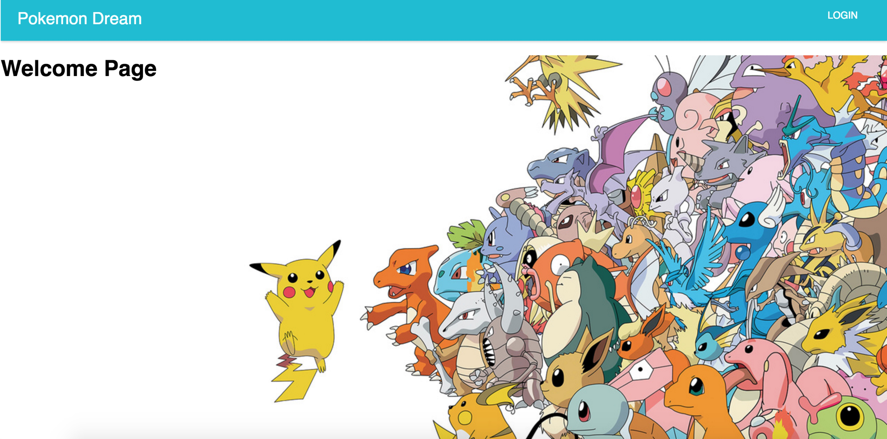
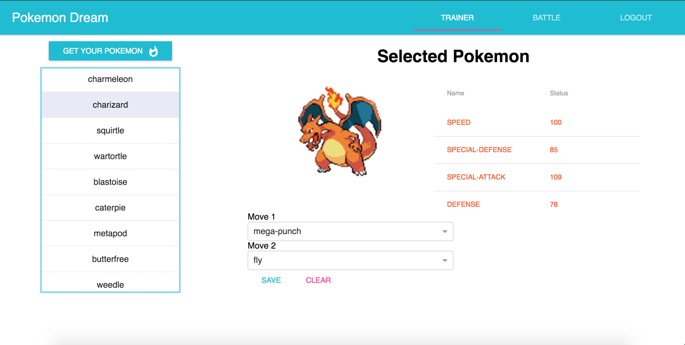
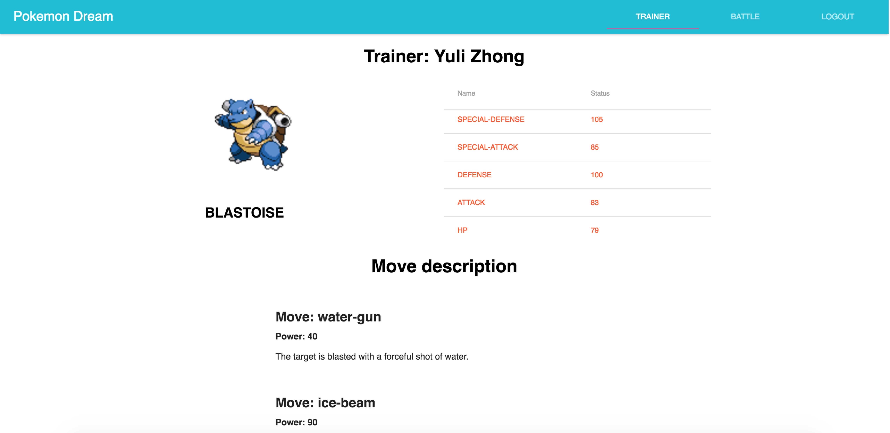
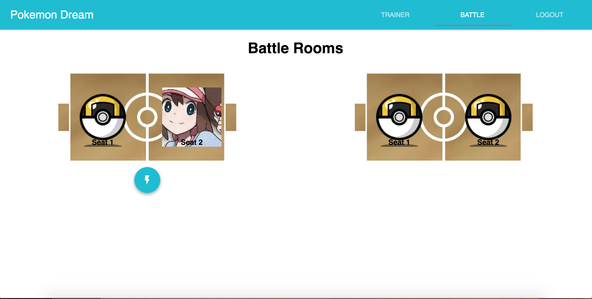
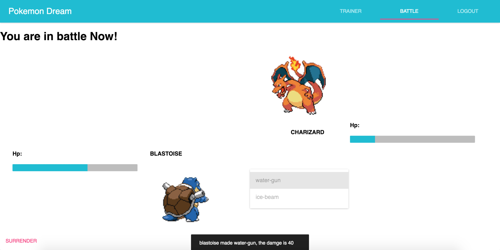
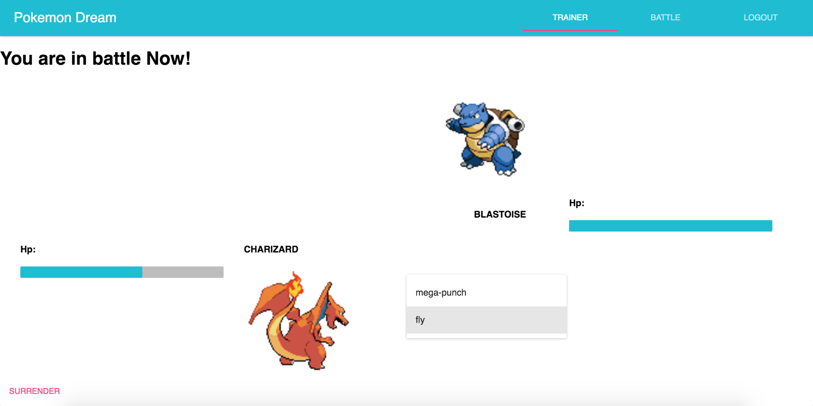
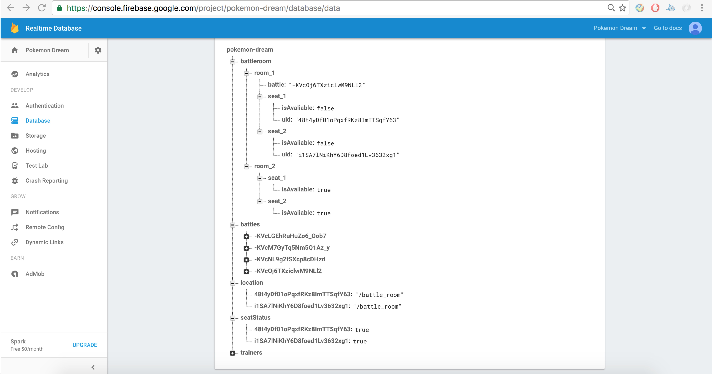

#Pokemon Dream (React + Redux +Realtime app)
###WDI Final Project!
#####*Pokemon image and moves information's copyright belong to Nitendo Co.*


##Installation
Clone the repo and then:  
````
npm start
````

##Trello Board
[Click me](https://trello.com/b/2lfz56sJ/pokemon-dream)
##Instruction
1. OAUTH login with your google accout
2. Select your pokemon and pick two moves
3. Go to the battleroom lobby
4. Pick a seat and wait for other trainer
5. One move each turn, switch turn then
6. Hp down to zero, the battle would be terminated and both trainer will be redirected to battleroom lobby.

##Technologies:  
* Front-end framework: **React**
* Back-end realtiem database: **Firebase**

##Libraries:
* React router
* Redux (Application state management)
* material-ui
* redux-thunk
* axios
* redux-form
* react-select

##Furture improvements
1. Battle logic on damage caluclation
2. More pokemon choice 
3. Implements for more battlerooms
4. Prevent creazy behavior from user(did't pick move forever, didn't leave their seat forever) 

##Some Screenshoots
######Trainer new:

######Trainer Info:

######Battlerooms:

######In battle trainer 1's view:

######Opponent's view:

####### Firebase flat data structure: 
